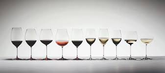

# Data Mining for Wine Quality Assessment
Wine quality, as Maynard Amerine once said, is easier to detect than define.
This is due to wine quality being primarily subjective to each individual.

  

In this project, I use R and apply data analysis techniques to aim to quantify
and to relate this very *subjective* taste of the wine with the chemical
properties of the wine, which are more *objective*.

Exploratory data analysis is an approach to analyzing data sets to summarize
their main characteristics, often with visual methods (Wikipedia). The following
 report details patterns discovery of red wine quality through data exploration
  and building of the predictive model based on chemical properties.

The complete R markdown can be access [here](https://github.com/SamDuan/Data-Mining-for-Wine-Quality-Assessment/blob/master/wine.md).

## Data Source
The dataset is provided by Udacity and can be downloaded [here](https://s3.amazonaws.com/udacity-hosted-downloads/ud651/wineQualityReds.csv).

## Requirements
R 3.2.2 or above is required to run the file and the following libraries need to
be installed:
* ggplot2
* GGally
* gridExtra

## License
The program is released under a MIT license.
