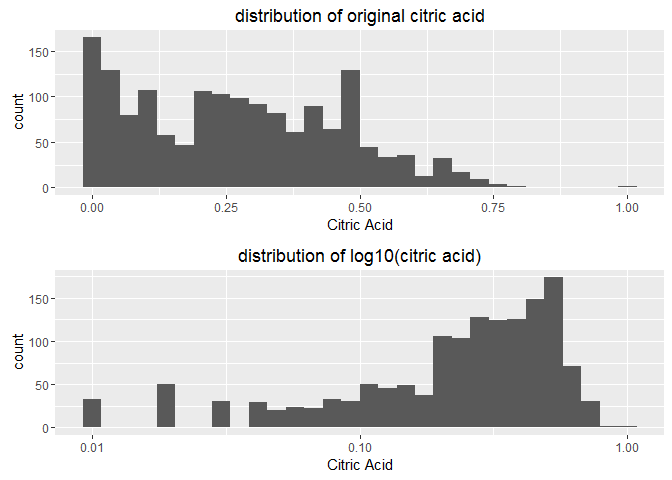
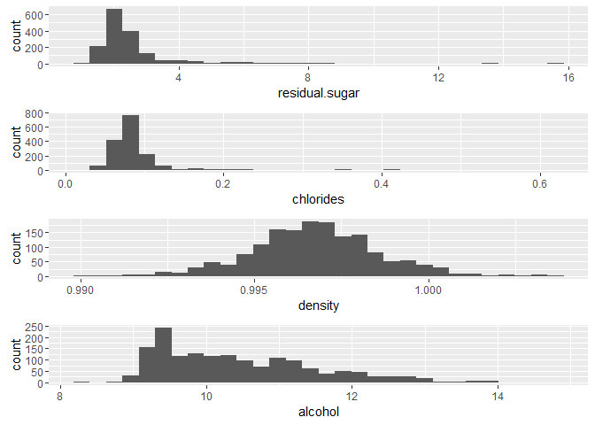
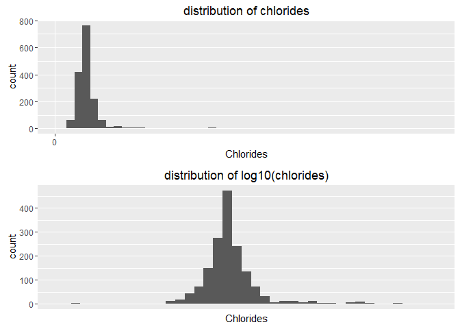
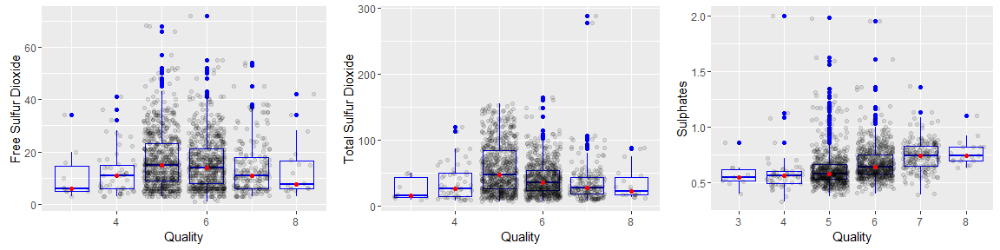

Red Wine Quality Exploration
================
Samuel Duan

Abstract
--------

In this project, I'm going to use R and apply data analysis techniques to identify the factors affecting red wine quality. Exploratory data analysis is an approach to analyzing data sets to summarize their main characteristics, often with visual methods (Wikipedia). The final result will include patterns discovery of red wine quality and predictive model based on chemical properties. The first section entails data exploration and the second part involves building predictive model.

Univariate Plots Section
------------------------

In this section, some preliminary exploration of the dataset is performed, including data set summary and histograms to show the distribution of each variable.
 

#### Summary of the dataset

    ## 'data.frame':    1599 obs. of  13 variables:
    ##  $ X                   : int  1 2 3 4 5 6 7 8 9 10 ...
    ##  $ fixed.acidity       : num  7.4 7.8 7.8 11.2 7.4 7.4 7.9 7.3 7.8 7.5 ...
    ##  $ volatile.acidity    : num  0.7 0.88 0.76 0.28 0.7 0.66 0.6 0.65 0.58 0.5 ...
    ##  $ citric.acid         : num  0 0 0.04 0.56 0 0 0.06 0 0.02 0.36 ...
    ##  $ residual.sugar      : num  1.9 2.6 2.3 1.9 1.9 1.8 1.6 1.2 2 6.1 ...
    ##  $ chlorides           : num  0.076 0.098 0.092 0.075 0.076 0.075 0.069 0.065 0.073 0.071 ...
    ##  $ free.sulfur.dioxide : num  11 25 15 17 11 13 15 15 9 17 ...
    ##  $ total.sulfur.dioxide: num  34 67 54 60 34 40 59 21 18 102 ...
    ##  $ density             : num  0.998 0.997 0.997 0.998 0.998 ...
    ##  $ pH                  : num  3.51 3.2 3.26 3.16 3.51 3.51 3.3 3.39 3.36 3.35 ...
    ##  $ sulphates           : num  0.56 0.68 0.65 0.58 0.56 0.56 0.46 0.47 0.57 0.8 ...
    ##  $ alcohol             : num  9.4 9.8 9.8 9.8 9.4 9.4 9.4 10 9.5 10.5 ...
    ##  $ quality             : int  5 5 5 6 5 5 5 7 7 5 ...

This data set contains 1599 observations and 11 chemical attributes that could affect the wine quality. The 11 chemical attributes are divided into 3 groups for analysis. The first group focuses on the attributes related to acidity in the wine, including fixed acidity, volatile acidity, citric acid and pH. The second group centers on the attributes related to sulfur, including free sulfur dioxide, total sulfur dioxide and sulphates. Note that sulfur dioxide and sulphates have the same molecular composition, but different degree of reactivity. Sulphates is more reactive than sulfur dioxide. The third group includes the remaining standalone attributes, including sugar, chloride, alcohol, and density. The exploration will be conducted by group.  

#### Distribution of wine quality

The mode of the wine quality is 5 and the distribution is unimodal.

#### Distribution of acidicity-related attributes

The distribution of pH resemble fixed and volatile acidity's, which are unimodal. However, the distribution of citric acid looks very different from the other three. It is skewed to the right significantly, and it looks like a multimodal distribution. Thus, it is plotted on a log scale to explore if there is any unseen features.

Nothing special is found when it is plotted on a log scale.

#### Distribution of sulfur-related attributes

These three distributions are skewed to the right.

#### Distribution of standalone attributes

The distribution of alcohol is skewed to the right, while density displays a normal distribution seemingly. Distributions of both residual sugar and chlorides are more spread out than those of density and alcohol. So axis breaks are customized to improve plots readability as shown below.

When residual sugar is plotted on a log scale, the dataset at the tail of the distribution on the right side becomes visible. It is a skewed right distribution.

Now we come to chlorides.

Likewise, when chlorides is plotted on a log scale, the dataset at the tail of the distribution on the right side becomes visible. It is a slightly skewed right distribution.  

Univariate Analysis
-------------------

### The structure of the dataset:

This data set contains 1599 observations and 11 chemical attributes that could affect the wine quality. All of 11 chemical attributes are numerical variables.

Other observations: 1. The distributions of density and pH value are symmetric while most of the attributes are skewed to the right.
2. Most of the attributes are unimodal distributions, but citric acid's has more than two prominent peaks.

### The main features of interest in te dataset:

The main features of interest after univariate analysis are density and pH value, since they resemble the distribution of the wine quality. In addition, both the distributions of density and pH value are unimodal.

### Unusual distributions observed:

Some of the attributes (e.g. residual sugar, chlorides) have narrow distributions and are positively skewed. Thus, these qualities are plotted on log scale to explore any hidden features at the tail of the distribution.  

Bivariate Plots Section
-----------------------

In this section, the relationships between chemical attributes and wine quality are investigated closely. The analysis is conducted by group as well.

#### Relationship between acidity-related variables and wine quality

Based on the set of plots above, no strong correlation is found between fixed acidity and wine quality, while volatile acidity and wine quality are negatively correlated. On the contrary, citric acid and wine quality are positively correlated. A week and negative correlation is found between pH and wine quality as well. (It is more visible if you follow the mean value drawn as red dots on the plot. Note that median value is chosen over mean here as a track point because most of the variables are skewed.) Lastly, the resemblance between pH and wine quality in their respective distributions shown in histogram, however, does not lead to a strong correlation.

#### Relationship between sulfur-related variables and wine quality

For both free sulfur dioxide and total sulfur dioxide, no strong correlation is found with the wine quality. However, a weak yet positive correlation is observed between sulfates and the wine quality.

#### Relationship between standalone variables and wine quality

The correlation between alcohol and quality are positive and strong, while the correlation density and quality is negative and weak. Despite both of the distributions of density and quality are symmetric in their respective histograms, it does not necessarily indicate they are highly correlated. Since both residual and chlorides have quite a number of outliers, the axis breaks need to be adjusted to improve plots readability.

As the breaks for y-axis is readjusted, the relationship between residual sugar/ chlorides and the wine quality can be seen more easily. No strong correlation between sugar and the wine quality, while a weak and negative correlation is found between chlorides and the wine quality.

To provide a bigger picture between chemical attributes and quality, a correlation matrix plot is drawn, showing the correlation between all the attributes.

Both this correlation chart and the above boxplots draw the same conclusion: volatile acidity and alcohol show stronger correlation with the wine quality. While the correlation between sulphates and wine quality is 0.3, many outliers were found in the boxplot.
 

Bivariate Analysis
------------------

### The relationships observed in this part of the investigation:

1.  When I explored the dataset by univariate plots, density and pH value are the only two attributes show symmetric distributions. At that time, it was suspected that they may have a stronger correlation with wine quality.
2.  However, as discussed briefly in the section of bavariate plots, volatile acidity and alcohol, rather than density and pH value show stronger correlation with the wine quality.
3.  Thus, the features of interest now are the volatile acidity and alcohol.
4.  The order of the variables in the matrix is selected that the variables in the same group (acidity-related, sulfur-related and standalone) are placed adjacent to each other. It can be seen that there is stronger relationship within the acidity-related group, while the other groups do not have strong internal connection within their groups.

### The strongest relationship found:

Between the chemical attribute: (1) pH value and fixed acidity (both in the same group), (2) citric acid and fixed acidity (both in the same group), and (3) density and fixed acidity (not in the same group). Between the wine quality and chemical attributes: alcohol and wine quality

### Interesting relationships between the other variables:

The strong correlation between fixed acidity and density looks quite interesting since it is not expected that they would be related.  

Multivariate Plots Section
--------------------------

Since unexpected correlation is found between fixed acidity and density, fixed acidity and density is plotted by quality to see if there is any pattern.

We can see some patterns here. At a given fixed acidity, if the density is higher, the quality is higher.

Next, to simplify the relationship, we create a new ordered variable with three levels for the wine quality. And linear regression lines are added for each of the three levels to highlight the patterns observed. Theme is made dark for readability.

However, according the drawing of the regression lines, the patterns are not so distinguishable.

Secondly, we are interested in alcohol and density. These two variables have relatively high correlation coefficient in the group of standalone variables. A plot of alcohol and density by quality is plotted.

We got more patterns here. At a given density, when alcohol is higher, the wine quality is better. Also, we add the regression lines to highlight the patterns observed.

Regression lines are more distinguishable in this case, indicating a stronger relationship between these three variables than the first three under investigation.

Now we employ stepwise model selection to determine which chemical attributes have an important role on the wine quality.

    ## Start:  AIC=-1375.49
    ## quality ~ fixed.acidity + volatile.acidity + citric.acid + residual.sugar +
    ##     chlorides + free.sulfur.dioxide + total.sulfur.dioxide +
    ##     density + pH + sulphates + alcohol
    ##
    ##                        Df Sum of Sq    RSS     AIC
    ## - density               1     0.287 666.70 -1376.8
    ## - fixed.acidity         1     0.389 666.80 -1376.5
    ## - residual.sugar        1     0.498 666.91 -1376.3
    ## - citric.acid           1     0.646 667.06 -1375.9
    ## <none>                              666.41 -1375.5
    ## - free.sulfur.dioxide   1     1.694 668.10 -1373.4
    ## - pH                    1     1.957 668.37 -1372.8
    ## - chlorides             1     8.391 674.80 -1357.5
    ## - total.sulfur.dioxide  1     8.427 674.84 -1357.4
    ## - sulphates             1    26.971 693.38 -1314.0
    ## - volatile.acidity      1    33.620 700.03 -1298.8
    ## - alcohol               1    45.672 712.08 -1271.5
    ##
    ## Step:  AIC=-1376.8
    ## quality ~ fixed.acidity + volatile.acidity + citric.acid + residual.sugar +
    ##     chlorides + free.sulfur.dioxide + total.sulfur.dioxide +
    ##     pH + sulphates + alcohol
    ##
    ##                        Df Sum of Sq    RSS     AIC
    ## - fixed.acidity         1     0.108 666.81 -1378.5
    ## - residual.sugar        1     0.231 666.93 -1378.2
    ## - citric.acid           1     0.654 667.35 -1377.2
    ## <none>                              666.70 -1376.8
    ## + density               1     0.287 666.41 -1375.5
    ## - free.sulfur.dioxide   1     1.829 668.53 -1374.4
    ## - pH                    1     4.325 671.02 -1368.5
    ## - total.sulfur.dioxide  1     8.728 675.43 -1358.0
    ## - chlorides             1     8.761 675.46 -1357.9
    ## - sulphates             1    27.287 693.98 -1314.7
    ## - volatile.acidity      1    35.000 701.70 -1297.0
    ## - alcohol               1   119.669 786.37 -1114.8
    ##
    ## Step:  AIC=-1378.54
    ## quality ~ volatile.acidity + citric.acid + residual.sugar + chlorides +
    ##     free.sulfur.dioxide + total.sulfur.dioxide + pH + sulphates +
    ##     alcohol
    ##
    ##                        Df Sum of Sq    RSS     AIC
    ## - residual.sugar        1     0.257 667.06 -1379.9
    ## - citric.acid           1     0.565 667.37 -1379.2
    ## <none>                              666.81 -1378.5
    ## + fixed.acidity         1     0.108 666.70 -1376.8
    ## + density               1     0.005 666.80 -1376.5
    ## - free.sulfur.dioxide   1     1.901 668.71 -1376.0
    ## - pH                    1     7.065 673.87 -1363.7
    ## - chlorides             1     9.940 676.75 -1356.9
    ## - total.sulfur.dioxide  1    10.031 676.84 -1356.7
    ## - sulphates             1    27.673 694.48 -1315.5
    ## - volatile.acidity      1    36.234 703.04 -1295.9
    ## - alcohol               1   120.633 787.44 -1114.7
    ##
    ## Step:  AIC=-1379.93
    ## quality ~ volatile.acidity + citric.acid + chlorides + free.sulfur.dioxide +
    ##     total.sulfur.dioxide + pH + sulphates + alcohol
    ##
    ##                        Df Sum of Sq    RSS     AIC
    ## - citric.acid           1     0.475 667.54 -1380.8
    ## <none>                              667.06 -1379.9
    ## + residual.sugar        1     0.257 666.81 -1378.5
    ## + fixed.acidity         1     0.133 666.93 -1378.2
    ## + density               1     0.028 667.03 -1378.0
    ## - free.sulfur.dioxide   1     2.064 669.13 -1377.0
    ## - pH                    1     7.138 674.20 -1364.9
    ## - total.sulfur.dioxide  1     9.828 676.89 -1358.5
    ## - chlorides             1     9.832 676.89 -1358.5
    ## - sulphates             1    27.446 694.51 -1317.5
    ## - volatile.acidity      1    35.977 703.04 -1297.9
    ## - alcohol               1   122.667 789.73 -1112.0
    ##
    ## Step:  AIC=-1380.79
    ## quality ~ volatile.acidity + chlorides + free.sulfur.dioxide +
    ##     total.sulfur.dioxide + pH + sulphates + alcohol
    ##
    ##                        Df Sum of Sq    RSS     AIC
    ## <none>                              667.54 -1380.8
    ## + citric.acid           1     0.475 667.06 -1379.9
    ## + residual.sugar        1     0.167 667.37 -1379.2
    ## + density               1     0.031 667.51 -1378.9
    ## + fixed.acidity         1     0.007 667.53 -1378.8
    ## - free.sulfur.dioxide   1     2.394 669.93 -1377.1
    ## - pH                    1     7.073 674.61 -1365.9
    ## - total.sulfur.dioxide  1    10.787 678.32 -1357.2
    ## - chlorides             1    10.809 678.35 -1357.1
    ## - sulphates             1    27.060 694.60 -1319.2
    ## - volatile.acidity      1    42.318 709.85 -1284.5
    ## - alcohol               1   124.483 792.02 -1109.4

    ##               Step Df  Deviance Resid. Df Resid. Dev       AIC
    ## 1                  NA        NA      1587   666.4107 -1375.489
    ## 2        - density  1 0.2868924      1588   666.6976 -1376.801
    ## 3  - fixed.acidity  1 0.1079824      1589   666.8056 -1378.542
    ## 4 - residual.sugar  1 0.2566805      1590   667.0623 -1379.926
    ## 5    - citric.acid  1 0.4748034      1591   667.5371 -1380.789

According the result from the model selection, the amount of (1) volatile acidity, (2) chlorides, (3) free.sulfur.dioxide, (4) total.sulfur.dioxide, (5) pH, (6) sulphates, and (7) alcohol would have an affect on the wine quality.

In the prior bivariate analysis, alcohol is the only attribute that shows strong correlation with the wine quality. At first, it seems to be contrary to the model selection result. As I look into the model selection as shown above, the removal of alcohol would cause a huge decrease in AIC value, while the removal of others affect AIC less significantly. In fact, this list shows roughly the influence of that attribute on the wine quality in an ascending order (that is from less important to more important).
 

Multivariate Analysis
---------------------

### The relationships observed in multivariate investigation:

In the prior discussion, alcohol influences the wine quality the most. This is confirmed by both the correlation plot in the bivariate analysis and the regression result in this section.

### Interesting or surprising interactions between features:

I am quite surprise that alcohol influences the wine quality so greatly, while the other attributes do not show the same degree of effect.

------------------------------------------------------------------------

Final Plots and Summary
-----------------------

### Plot 1: Relationship between the wine quality and standalone variables

From this set of six figures above, we could perceive the relationship between the wine quality and 4 standalone chemical attributes (residual sugar, chlorides, alcohol and density). It is visible that the correlation between alcohol and quality are positive and strong, while the correlation density and quality is negative and weak. Despite both of the distributions of density and quality are symmetric in their respective histograms, it does not necessarily indicate they are highly correlated. Since both residual and chlorides have quite a number of outliers, the axis breaks need to be adjusted to improve plots readability.

As the breaks for y-axis is readjusted, the relationship between residual sugar chlorides and the wine quality can be seen more easily, which are called "the closer look" in the middle row. No strong correlation between sugar and the wine quality, while a weak and negative correlation is found between chlorides and the wine quality.

### Plot 2: Correlation matrix

A correlation matrix plot is drawn, showing the correlation between all the attributes. Particularly, the correlation with the wine quality is of our interest. Alcohol, volatile acidity, and sulphates are the top three factors having significant relation with the wine quality.

The order of the variables in the matrix is selected that the variables are placed by group (acidity-related, sulfur-related and standalone groups). It can be seen that there is stronger relationship within the acidity-related group (on the left side of the plot), while the other groups do not have strong internal connection within their groups.

### Plot 3: Relationship of density and alcohol with quality levels

Here alcohol and density are of interest because these two variables have relatively high correlation coefficient in the group of standalone variables. A plot of alcohol and density by quality is plotted.

Some patterns are found here. At a given density, when alcohol is higher, the wine quality is better. Also, we add the regression lines to highlight the patterns observed.

------------------------------------------------------------------------

Reflection
----------

This red wine quality was created using red wine samples (1599 observations as total), based on the median of at least 3 evaluation made by wine experts. 11 quantitative wine attributes, which were generated through more objective tests, are included in this data set.

At the beginning, while 13 variables doesn't seem like much, it does lead to a lot of dead ends which was very time consuming.

Then we thought that our analysis may be simplified by regrouping the variables. Thus, we divided the variables into 3 groups, namely, the acidity-related group, the sulfur-related group and the standalone variables group. It makes the whole process analysis more straight forward and clearer.

In the univariate section, histograms provide a general idea of the dataset we are handling, but do not so shed too much light on their relationship. It was suspected that a closer likeness between the variables' distribution may lead to a stronger relationship, but it was proved to be partially right as we proceeded to the bivariate section.

In the bivariate section, we analyzed the relationship by plotting boxplots. It became quite helpful to put the boxplots within the group side by side to have a broader view on their relationship.

The residual sugar and chlorides plots require further optimization on the y-axis setting, because of their narrow distribution. It is quite interesting to find out the seemingly hidden relationship between chlorides and the wine quality.

In the multivariate section, it is quite challenging to decide where to start. Fixed acidity and density were selected at first since they showed unexpected strong correlation. Later, alcohol and density were selected because they have the strongest correlation in the standalone variables group. Some patterns are found and with the use of regression lines, we are able to see the patterns more clearly: At a given density, when alcohol is higher, the wine quality is better.

Lastly, based on the predictive model and above analysis, we conclude the amount of alcohol content in the wine is the most influential factor in determining the wine quality. In addition to alcohol, volatile acidity, sulphates, chlorides, total sulfur dioxide, pH, free sulfur dioxide (in the order of importance) are included in the final model to give the best fitting result.

For the future work, there are couple ideas to consider as follows:
1. Different machine algorithms can be implemented in search for a better model for prediction.
2. The trends we observed here are for red wines, but how about the behavior of the variables for white wines? What do we expect would change?
3. We are only analyzing one specific type of wine from one specific country. How about other red wines from other types of the globe?
4. It would worth considering why we have so many ‘average’ wines compared to poor and good ones. In practice, the ratings we have are averages that we obtained from different experts. Does that bias our analysis anyhow? Do we think ‘averaging’ the ratings provided by different tasters relate with having too many “average” final ratings?
